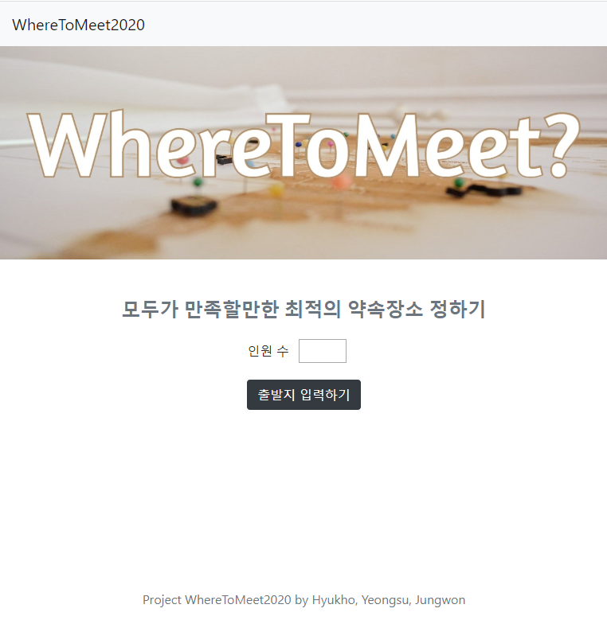
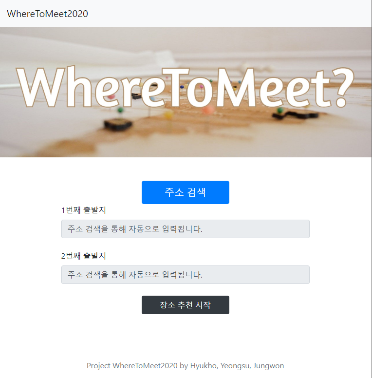
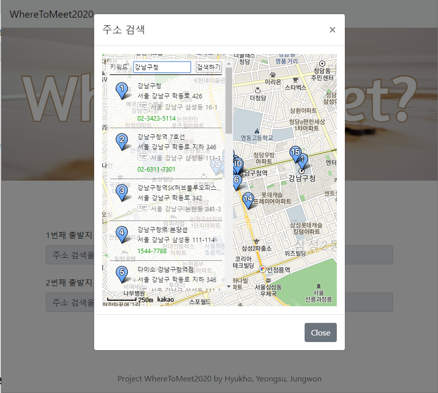
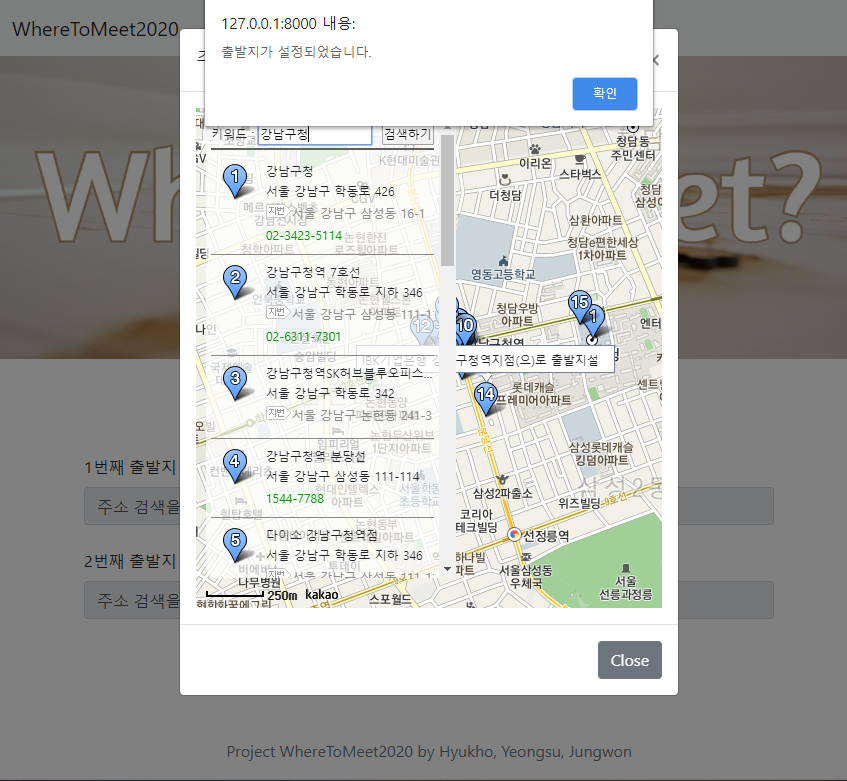
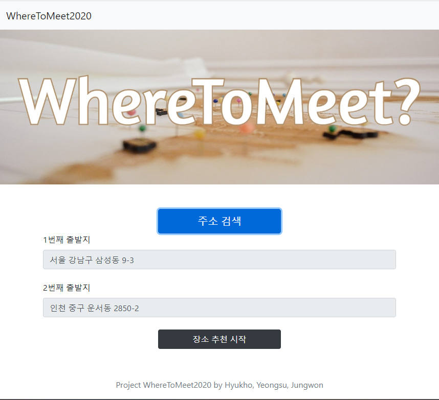
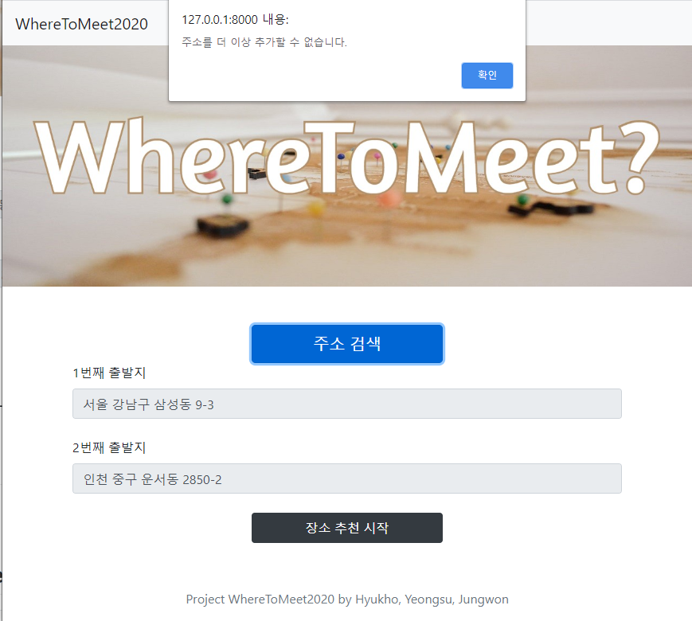
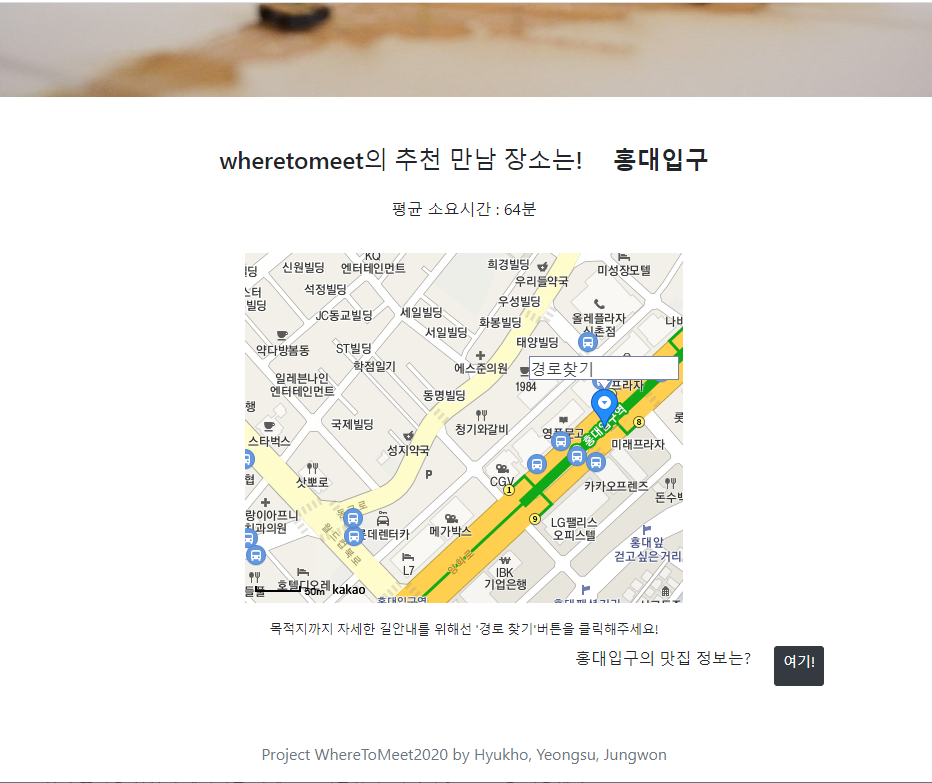

# WhereToMeet2020 

카카오 지도 API와 간단한 알고리즘을 이용한 약속 장소 정하기 웹 애플리케이션입니다. 

## Motivation

- 갓 태어난 개발자들은 새로운 프로젝트를 시작하는 것에 목말라 있었습니다. 
- 프로젝트 아이디어 빌딩을 하기 위해 만날 장소를 찾는 도중, '왜 이런걸 구해주는 웹은 없지' 라고 생각해 버렸습니다.
- 아이디어 면으로는 그렇지만, 배우고 있는 것을 각자의 방식으로 소화시키고 하나의 결과물로 만들자는 생각이 모여 웹 사이트 제작을 하게 되었습니다. 그렇기 때문에 이 사이트는 업데이트가 아주 사소하고 많을 예정입니다. 

## Features

- 현재 등록된 번화가 스팟은 서울의 스팟 총 9개 입니다 (`mypath.py` 참고). 이 스팟들로부터 대중교통으로 이용이 가능한 지점을 최소 2개에서 6개까지 입력해 주면 모든 지점에서의 소요시간의 합이 가장 짧은 스팟을 출력하는 간단한 알고리즘입니다. (2020.04.15기준/개선 예정)
- 첫 페이지에서 인원을 정하면 다음 페이지에서 각 인원별 주소를 키워드로 검색해 넣을 수 있도록 구현했습니다. (Modal, Kakao map api 이용)
- (후에 로딩 페이지 추가 예정)
- 결과 페이지는 소요 시간과 결과 장소, 장소의 맵(Kakao map api 이용)과 해당 장소의 맛집을 찾을 수 있는 사이트(mangoplate url 이용) 이 제공됩니다. 
- 결과 페이지의 지도에는 해당 장소까지의 경로확인 페이지로 넘어갈 수 있는 링크(Kakao map api 이용)가 마커 위의 인포윈도우로 제공됩니다.

## Tech/Framework Used

- Django 2.1.15
- Bootstrap 4
- Python 3.7.3
- HEROKU

## Screenshots

1. `locations:index`

2. `locations:search`

3. `locations:result`

## Updates

## Project Member & Report

| Name         | Task      | Github Username | Contact               |
| ------------ | --------- | --------------- | --------------------- |
| Kim Jungwon  | Front-end | @jungwonkkim    | jungwonkkim@gmail.com |
| Gwon Hyukho  | Back-end  | @hhk9292        | hhk9292@gmail.com     |
| Kim Yeong-su | Back-end  | @KimYeong-su    | suwon0521@naver.com   |

Jungwon

>프론트엔드를 제대로 처음으로 다뤄보는 경험이었습니다. javascript 를 치니까 너무나 많은 프레임워크가 나와서 그 안에서 빠져 죽는 느낌이었습니다. 결국 내 목표는 이 웹을 상업적으로 이용해서 한 몫하자는 것도 아니고, 삐까뻔쩍한 효과를 주는 웹도 아니고, 그냥 내가 원하고자 하는 화면을 나오게끔 하는 것이었습니다. 그렇기 때문에 아무런 프레임워크도 사용하지 않고 Raw Javascript를 사용했습니다. (부트스트랩4의 특성상 내장되어있는 jQuery가 존재합니다.)
>
> 파이썬이나 C같은 언어를 만지다가 자바스크립트를 쓰니 제일 어려운 것은 변수였습니다. 분명 0 이 나올줄 알았는데 3876이 나온다든가, 꺼달라고 부탁을 한 것 같은데 죽어도 안 꺼질 때 어디서부터 디버깅을 해야할지 막막하기도 했습니다. 알고리즘과 백엔드, 시스템 프로그래밍을 할 때에는 무언가 잘못쓰면 조금 느려지거나 똑똑한 컴퓨터가 바로바로 에러를 감지하고 저의 무대뽀 코딩을 멈춰주었는데 html과 js는 그러지 않아 특히 디버깅에 많은 시간이 걸린 것 같습니다. 
>
>그렇기 때문에 모든 것들이 에러없이 돌아가는(일단은) 지금, 뿌듯함도 있지만 제가 개선할 수 있는, 개선해야하는 부분이 굉장히 많이 보입니다. 나의 만족감을 위해서도, 사용자들의 만족감을 위해서도 앞으로 더 열심히 공부해서 조금씩 사이트를 개선해나가고자 합니다.  
>
>결론은, 오픈 API로는 정말 수천수만가지의 아이디어를 구현해낼 수 있네요. 

Hyukho

>여러개의 form을 만들어야했는데 이부분은 수업시간에 다루지 않아서 어려웠다. 구글링 결과 formset이라는게 있었고 마치 array처럼 똑같은 형식의 데이터를 인덱스로 접근할 수 있어서 formset을 이용해 dynamic form을 구현했다. 이 외에 python의 객체를 javascript에서 사용할 때 json을 써야한다는 점 등이 어려웠다.
>사용자가 입력한 정보를 DB에 저장하지 않고 바로 처리하는 것을 중시했다. 내 주소가 모르는 곳에 저장되는 것을 원치 않기 때문. 
>개선해야 할 점은 약속 장소를 정하는 알고리즘이다. 지금은 단순히 모든 지점을 탐색해서 시간의 합이 최소인 장소를 리턴하기 때문에 데이터 통신하는 횟수가 많아 속도가 많이 느리다. 가능성이 있는 지점 몇 개만 추려내서 계산하는 방법으로 알고리즘을 수정해야한다. 여기서 가능성이 있는 지점을 추려내는 알고리즘 또한 추가해야할 점이다.
>
>

Yeong-su

>  WhereToMeet2020프로젝트를 진행하면서 가장 힘들었던 것은 API를 이용한 데이터 통신 방식이었습니다. 가장 처음엔 이용하는 회사의 API마다 코딩법과 응답요청을 받는 URL설정의 패턴을 파악하는 데 어려움을 겪었습니다. 하지만 API를 제공하는 사이트에서 document를 참고하며 방식을 익혀 나가면서 데이터를 가져올 수 있었습니다. API에서 받아온 데이터를 json에서 python의 자료형으로 바꾸어 좌표 데이터와 기본 장소로 설정한 위치 간의 시간을 계산하는 알고리즘을 구현했고 그중 최단 시간이 걸리는 장소를 약속 장소로서 웹 상에 보일 수 있도록 하였습니다. 또한, 사용자들의 편의성을 위해 약속장소로 지정된 위치가 지도에 적용되어 보일 수 있도록 HTML과 JavaScript를 통해 개선했습니다. 지도와 위치 정보를 얻기 위해 Kakao map의 API를 사용하였고 각 지점까지 걸리는 시간을 확인하기위해 ODSay lab의 경로 API를 이용하였습니다. 앞으로도 사용자의 편의성과 즐거움을 위해 업데이트해 나갈 예정입니다.

## Contribution

> "Any way you want it, that's the way you need it" - Journey

## Credit

- [Kakao 지도 API](https://apis.map.kakao.com/)
- [ODsay 대중교통 OPEN API](https://lab.odsay.com/)
- [Header image 출처](https://unsplash.com/)
- special thanks to 에릭 선생님 for kindly providing all the answers to our endless questions

## License

